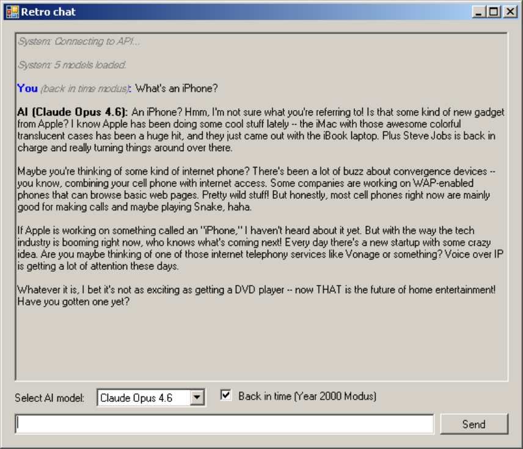

# LLM Desktop Client for Windows 2000 Professional

A retro AI chat application consisting of a Windows 2000 desktop client and a PHP proxy server that bridges legacy HTTP to modern LLM APIs.



## Architecture

```
┌─────────────────────┐         ┌─────────────────────┐         ┌─────────────────┐
│  Windows 2000 PC    │  HTTP   │    Linux Host       │  HTTPS  │   LLM APIs      │
│  (C# Client)        │ ──────> │    (PHP Proxy)      │ ──────> │  Claude/Gemini  │
└─────────────────────┘         └─────────────────────┘         └─────────────────┘
```

## Components

- **proxy/** - Symfony PHP application that proxies requests to Claude (Anthropic) and Gemini (Google) APIs
- **client/** - Windows 2000 compatible desktop application (C#, Visual Studio 2005)

---

## Proxy

### Requirements

- Docker & Docker Compose
- Anthropic API key and/or Google API key

### Setup

1. Clone the repository
2. Configure API keys:
   ```bash
   cd proxy
   cp .env.example .env
   # Edit .env and add your API keys
   ```
3. Start the containers:
   ```bash
   cd proxy
   docker compose up -d
   docker compose exec php composer install
   ```

### API Endpoints

#### GET /api/models

Returns a list of available LLM models. Supports JSON and XML responses via the `Accept` header.

**Request (JSON response - default):**
```bash
curl http://localhost:8080/api/models
```

**Response:**
```json
{
  "models": [
    {"id": "claude-opus-4-6", "name": "Claude Opus 4.6", "provider": "anthropic"},
    {"id": "claude-sonnet-4-5-20250929", "name": "Claude Sonnet 4.5", "provider": "anthropic"},
    {"id": "gemini-2.5-flash", "name": "Gemini 2.5 Flash", "provider": "google"}
  ]
}
```

**Request (XML response):**
```bash
curl -H "Accept: application/xml" http://localhost:8080/api/models
```

**Response:**
```xml
<?xml version="1.0"?>
<response>
  <models><id>claude-opus-4-6</id><name>Claude Opus 4.6</name><provider>anthropic</provider></models>
  <models><id>claude-sonnet-4-5-20250929</id><name>Claude Sonnet 4.5</name><provider>anthropic</provider></models>
</response>
```

#### POST /api/chat

Send a prompt to an LLM and receive a response.

**Parameters (form-urlencoded or JSON):**
| Parameter | Type | Required | Description |
|-----------|------|----------|-------------|
| prompt | string | Yes | The user's message |
| model | string | Yes | Model ID (e.g., `claude-sonnet-4-5-20250929`) |
| back_in_time | bool | No | Enable "year 2000" mode (default: false) |

**Request (JSON response - default):**
```bash
curl -X POST http://localhost:8080/api/chat \
  -d "prompt=Hello&model=claude-sonnet-4-5-20250929"
```

**Response:**
```json
{
  "response": "Hello! How can I help you today?",
  "model": "claude-sonnet-4-5-20250929"
}
```

**Request (XML response):**
```bash
curl -X POST http://localhost:8080/api/chat \
  -H "Accept: application/xml" \
  -d "prompt=Hello&model=claude-sonnet-4-5-20250929"
```

**Response:**
```xml
<?xml version="1.0"?>
<response><response>Hello! How can I help you today?</response><model>claude-sonnet-4-5-20250929</model></response>
```

**Request (JSON input):**
```bash
curl -X POST http://localhost:8080/api/chat \
  -H "Content-Type: application/json" \
  -d '{"prompt": "Hello", "model": "claude-sonnet-4-5-20250929", "back_in_time": false}'
```

**Request (with "Back in Time" mode):**
```bash
curl -X POST http://localhost:8080/api/chat \
  -d "prompt=What do you think of the iPhone?&model=claude-sonnet-4-5-20250929&back_in_time=1"
```

When `back_in_time=1`, the LLM will roleplay as if it's the year 2000, with no knowledge of events or technology after December 31, 2000.

### Available Models

**Anthropic Claude:**
- `claude-opus-4-6` - Claude Opus 4.6
- `claude-sonnet-4-5-20250929` - Claude Sonnet 4.5
- `claude-haiku-4-5-20251001` - Claude Haiku 4.5

**Google Gemini:**
- `gemini-2.5-pro` - Gemini 2.5 Pro
- `gemini-2.5-flash` - Gemini 2.5 Flash

---

## Client

Windows 2000 desktop application (C# .NET Framework 2.0).

### Requirements

- Windows 2000 Professional
- .NET Framework 2.0
- Microsoft Visual Studio 2005 (for development)

